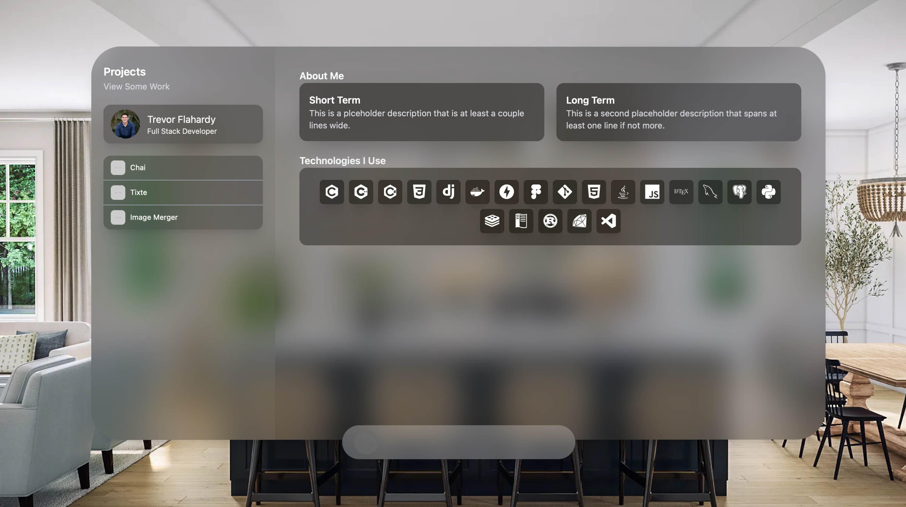
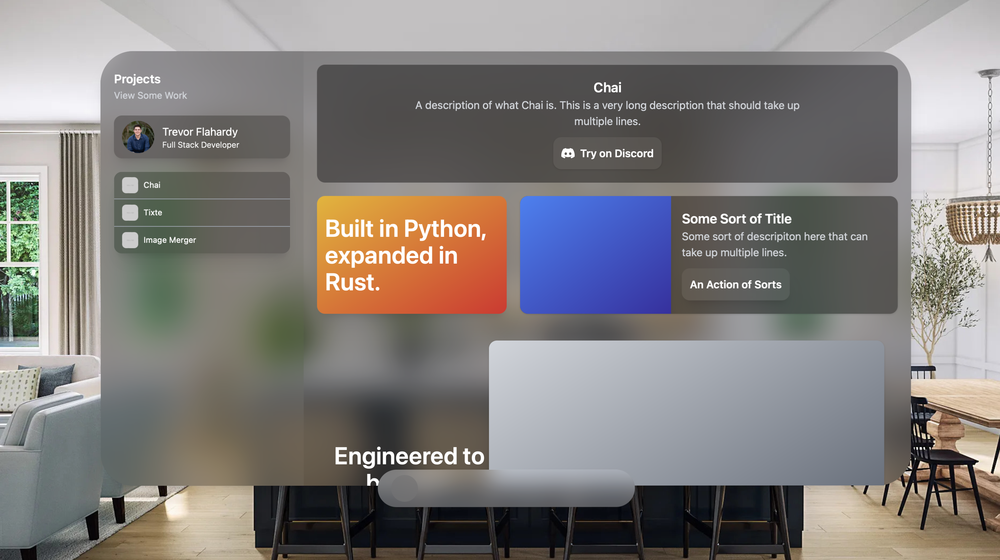

# Personal Website

View the website on [Github Pages](https://trevorflahardy.github.io/Personal-Website/) if you'd like!

This is a backrgound project of mine to get a personal website running for internship applications in gthe near future. This is a work in progress, basically everything is subject to change - but the main idea is that the website is going to be centered around mimicing Apple's VisionOS within a web application, which I thought was a nifty idea.




## Installing

```sh
git clone https://github.com/trevorflahardy/Personal-Website
cd Personal-Website
npm install
```

## Running

### Compile and Hot-Reload for Development

```sh
npm run dev
```

### Compile and Minify for Production

```sh
npm run build
```
