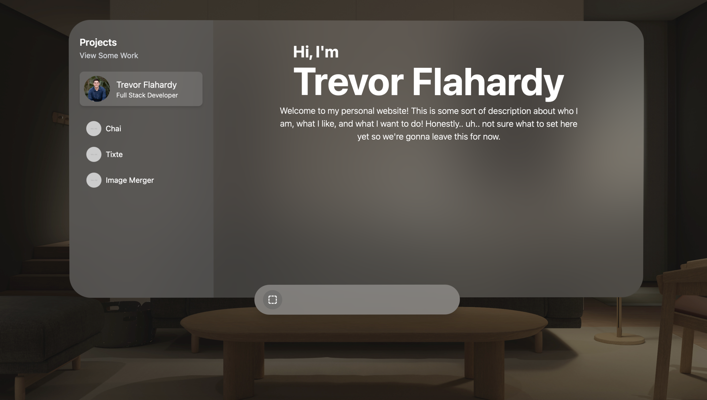
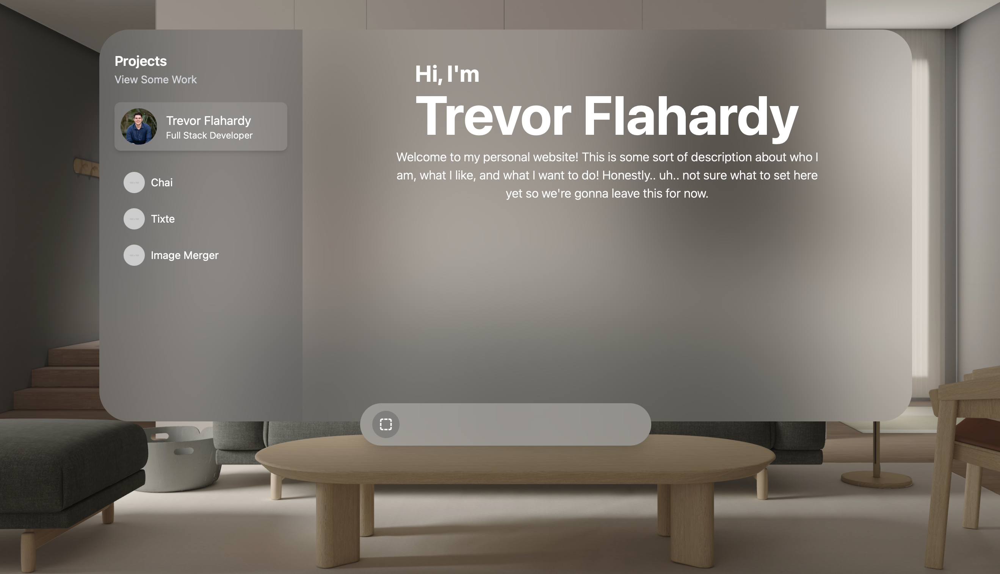
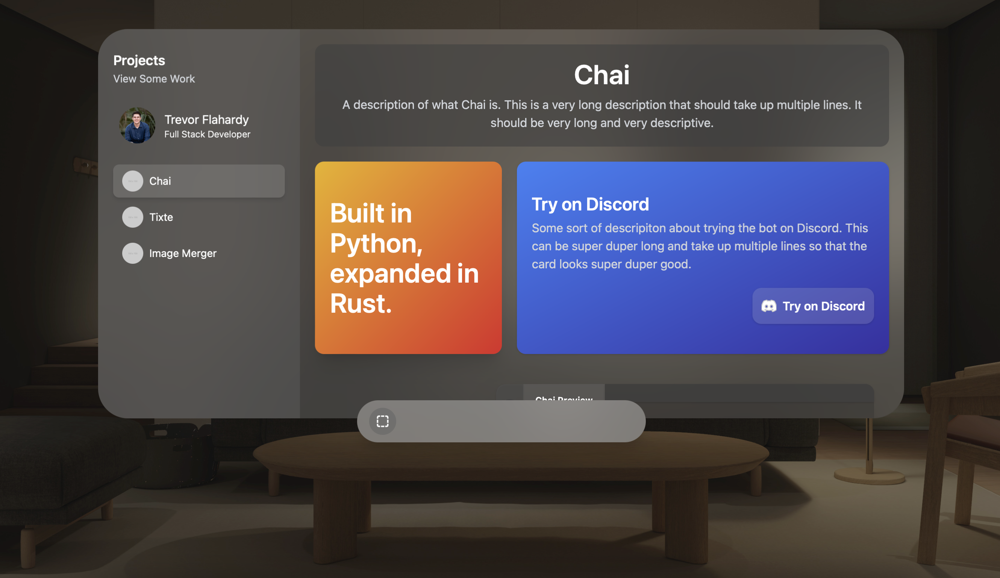
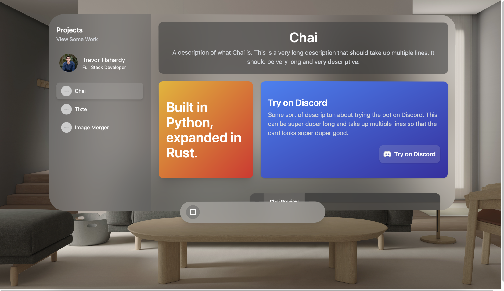
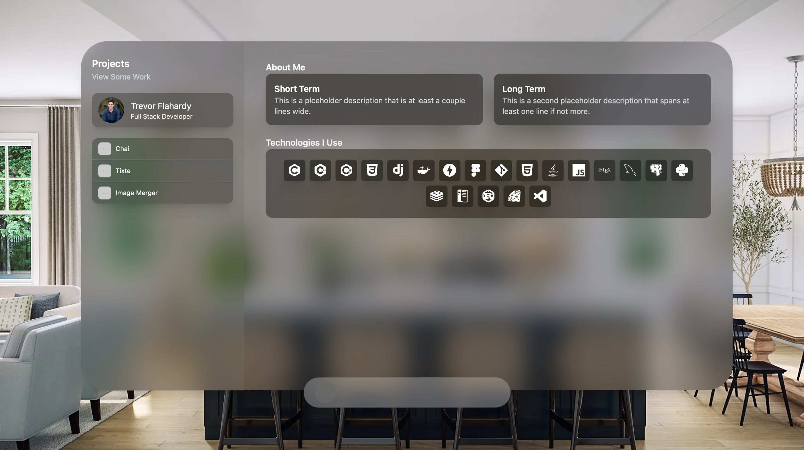
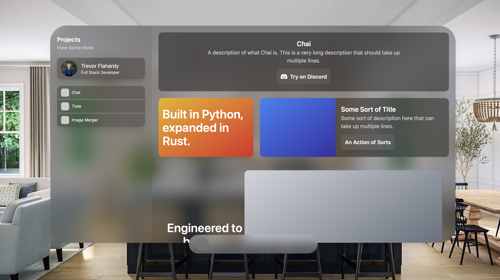

# Personal Website

This is a background project of mine to get a personal website running for internship applications in the near future. This is a work in progress, basically everything is subject to change - but the main idea is that the website is going to be centered around mimicking Apple's VisionOS within a web application, which I thought was a nifty idea.


## Mobile Tablets and Phones


## Installing

```sh
git clone https://github.com/trevorflahardy/Personal-Website
cd Personal-Website
npm install
```

## Running

### Compile and Hot-Reload for Development

```sh
npm run dev
```

### Compile and Minify for Production

```sh
npm run build
```

## Previous Previews

## Progress Tracking

I'm keeping track of my progress as I continue to work on my website. Here are some previous versions as I figure out what I want and what I like. The version tracking is from newest to oldest.

### Version 4

Apr 29th, 2026: Version 4; large updates to UI and all of the pages. With many of my projects I dive into something very new for me, so naturally, I want each page to feel like its own adventure as well.


### Version 3

September 21st, 2024: I'm dubbing Version 3 of this project; I feel it's changed enough to constitute a progress update. I still have hopes for the following, which I plan to address in the coming update

- [x] More content on the profile page, like hobbies, education, achievements, and _why_ my personal website looks as it does.
- [x] A cleaner Docuflow page which has the name of "Docuflow" in the title perhaps
- [x] A cleaner Chai introduction which has some better branding elements
- [x] Updating some inconsistencies that are bothering me, specifically the glass on light mode being way too dark.


### Version 2






### Version 1



